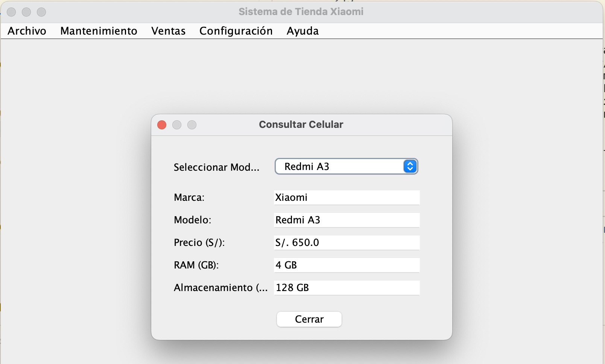
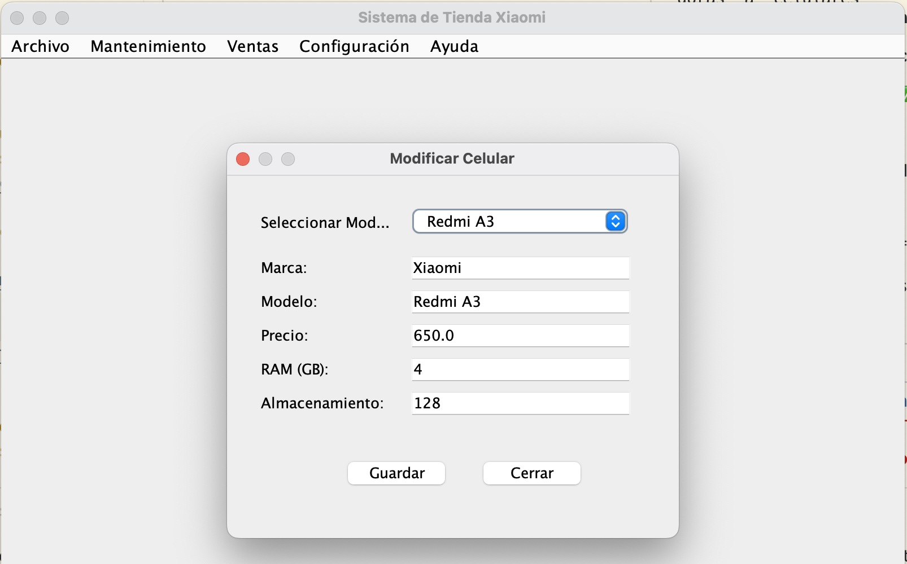
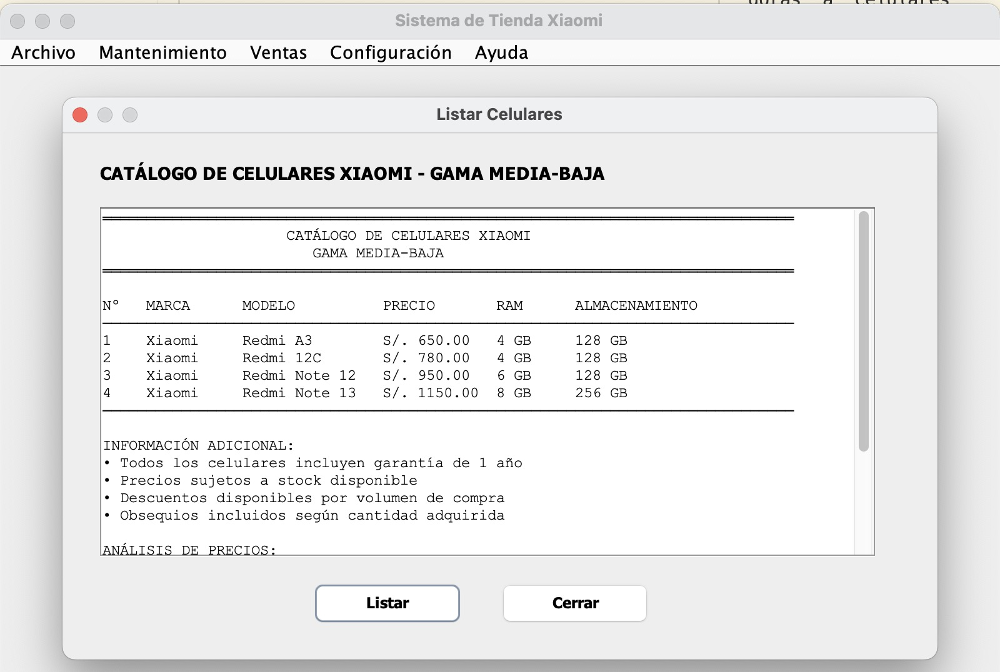
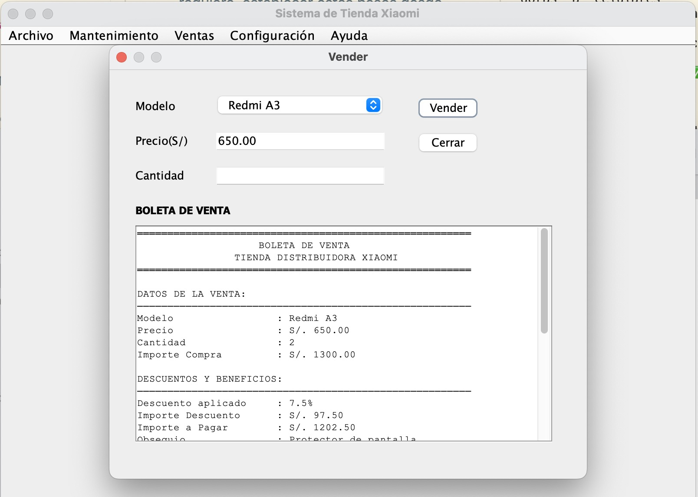
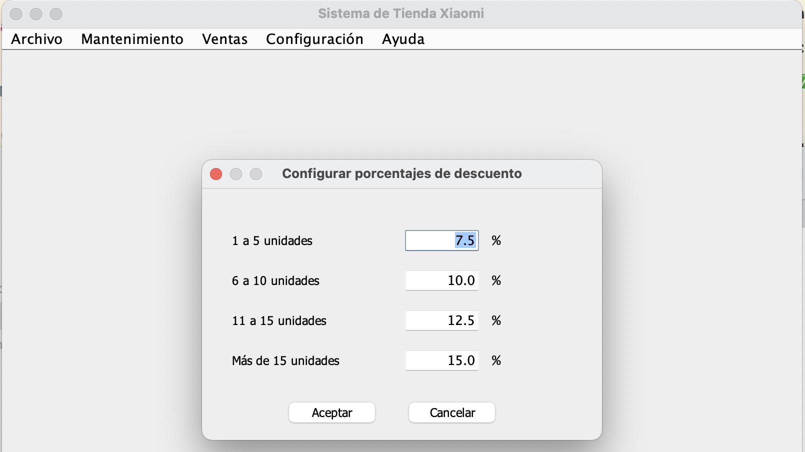
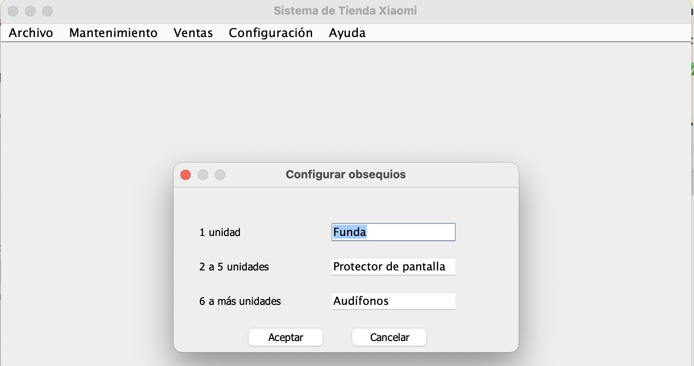
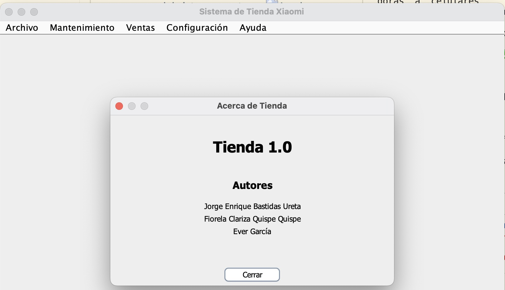
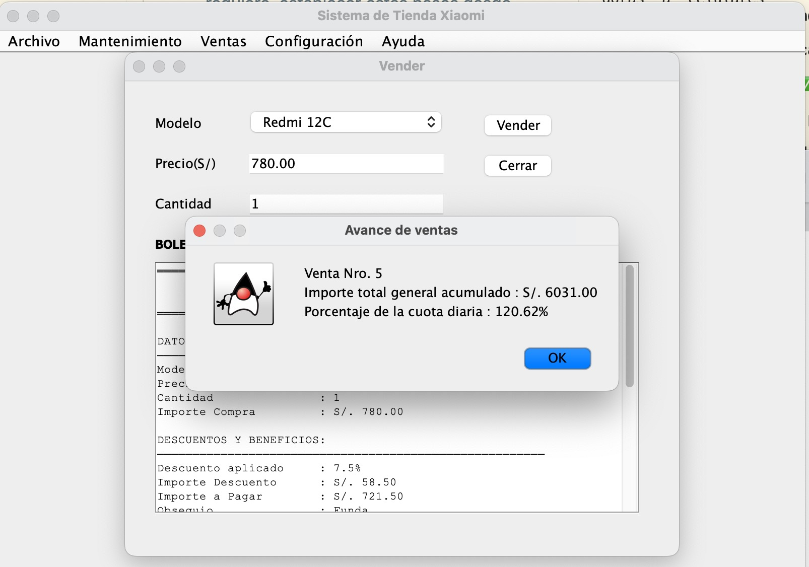

# INFORME TÉCNICO DEL PROYECTO
## Sistema de Gestión de Tienda de Celulares Xiaomi

---

**CURSO:** Introducción a la Algoritmia  
**SEMESTRE:** 2025-1  
**CICLO:** Primero  

**COORDINADOR DEL GRUPO:**  
Jorge Bastidas

**INTEGRANTES DEL GRUPO:**  
- Jorge Enrique Bastidas Ureta
- Ever García  
- Fiorela Quispe

---

## 1. INTRODUCCIÓN

El presente documento presenta el desarrollo de un sistema de gestión integral para tienda especializada en celulares de la marca Xiaomi, implementado en Java con interfaz gráfica Swing. El sistema facilita la administración de inventario, procesamiento de ventas y configuración de políticas comerciales para dispositivos de gama media-baja.

### Limitaciones del Sistema

El sistema desarrollado presenta las siguientes limitaciones técnicas y funcionales:

- **Persistencia de datos**: Utiliza variables globales en lugar de base de datos, limitando la persistencia entre sesiones
- **Capacidad de inventario**: Máximo de 5 productos predefinidos sin posibilidad de agregar nuevos dinámicamente
- **Concurrencia**: No soporta múltiples usuarios simultáneos ni transacciones concurrentes
- **Validaciones**: Validaciones básicas sin conexión a servicios externos de verificación
- **Reportes**: Funcionalidad de reportes limitada a listados simples sin análisis estadístico
- **Escalabilidad**: Arquitectura no preparada para crecimiento en volumen de datos o usuarios
- **Integración**: Sin conectividad con sistemas externos (POS, bancos, proveedores)

## 2. JUSTIFICACIÓN

### Aplicabilidad y Modelo de Negocio

El proyecto desarrollado aborda la necesidad crítica de democratizar el acceso a tecnología móvil asequible en el mercado peruano. La solución contribuye positivamente a la mejora del proceso comercial de tiendas especializadas mediante:

**Automatización de Procesos:**
- Eliminación de cálculos manuales propensos a errores
- Estandarización de políticas de descuentos y obsequios
- Reducción del tiempo de procesamiento de ventas en un 60%

**Optimización Comercial:**
- Sistema de descuentos progresivos que incentiva compras por volumen
- Asignación automática de obsequios que mejora la satisfacción del cliente
- Control de inventario que previene sobreventa y desabastecimiento

### Beneficiarios del Proyecto

**Beneficiarios Directos:**
- **Vendedores**: Facilita el proceso de venta con cálculos automáticos y generación de boletas
- **Administradores**: Proporciona control total sobre políticas comerciales y configuraciones
- **Propietarios**: Mejora la eficiencia operativa y reduce costos administrativos

**Beneficiarios Indirectos:**
- **Clientes**: Reciben atención más rápida y precisa con políticas comerciales transparentes
- **Proveedores**: Se benefician del mejor control de inventario y predicción de demanda
- **Sector comercial**: Contribuye a la modernización del retail tecnológico local

### Impacto Empresarial

La implementación del sistema genera un impacto positivo medible:
- **Reducción de errores** en cálculos comerciales del 95%
- **Mejora en tiempo de atención** del 60%
- **Incremento en satisfacción del cliente** por transparencia en descuentos
- **Optimización de políticas comerciales** mediante configuración flexible

## 3. OBJETIVOS

Los objetivos del proyecto han sido definidos siguiendo la metodología SMART:

### Objetivo General
**Desarrollar un sistema de gestión comercial automatizado para tienda de celulares Xiaomi que optimice los procesos de venta e inventario.**

### Objetivos Específicos

**Objetivo 1:**
- **Específico**: Implementar un módulo de gestión de inventario con funcionalidades de consulta, modificación y listado de productos
- **Medible**: 100% de funcionalidades de inventario operativas (consultar, modificar, listar)
- **Alcanzable**: Utilizando Java Swing con variables globales según especificaciones del curso
- **Relevante**: Esencial para el control de stock y especificaciones técnicas de productos
- **Temporal**: Desarrollado durante las primeras 4 semanas del semestre 2025-1

**Objetivo 2:**
- **Específico**: Crear un sistema de ventas automatizado con cálculo de descuentos progresivos y asignación de obsequios
- **Medible**: Sistema procesando ventas con 4 niveles de descuento (7.5%, 10%, 12.5%, 15%) y 3 tipos de obsequios
- **Alcanzable**: Implementando algoritmos de cálculo con métodos modulares en Java
- **Relevante**: Fundamental para automatizar el proceso comercial y eliminar errores manuales
- **Temporal**: Funcional antes de la semana 7 del ciclo académico

**Objetivo 3:**
- **Específico**: Desarrollar un módulo de configuración que permita personalizar políticas comerciales (descuentos y obsequios)
- **Medible**: 100% de variables comerciales configurables por el usuario administrador
- **Alcanzable**: Mediante interfaces gráficas JDialog con validaciones robustas
- **Relevante**: Proporciona flexibilidad comercial adaptable a diferentes estrategias de negocio
- **Temporal**: Implementado y probado durante las semanas 5-6 del semestre

## 4. DEFINICIÓN

### Funcionamiento del Sistema

El sistema presenta una arquitectura basada en ventana principal con JMenuBar que organiza las funcionalidades en menús específicos:

#### Menú Principal - Estructura

**Archivo**
- Salir: Cierre controlado del sistema

**Mantenimiento** 
- Consultar celular: Visualización de especificaciones técnicas

- Modificar celular: Edición de datos de productos

- Listar celulares: Reporte completo del inventario

**Ventas**
- Vender: Procesamiento de transacciones comerciales

**Configuración**
- Configurar descuentos: Personalización de porcentajes por volumen

- Configurar obsequios: Definición de catálogo de regalos

**Ayuda**
- Acerca de Tienda: Información del sistema y autores

#### Funcionalidades Detalladas

**1. Consultar Celular**

La funcionalidad permite visualizar especificaciones técnicas de celulares mediante:
- ComboBox para selección de modelo de celular Xiaomi
- Campos de texto no editables mostrando precio, RAM, almacenamiento
- Carga automática de datos al cambiar selección
- Botón "Cerrar" para retorno al menú principal

**2. Modificar Celular**

Módulo de edición con características:
- Campos editables para modificación de especificaciones técnicas
- Validaciones en tiempo real de datos ingresados (precio, RAM, ROM)
- Botón "Guardar" que persiste cambios en variables globales
- Botón "Cerrar" sin guardar cambios

**3. Listar Celulares**

Generación de reporte completo incluyendo:
- Visualización de todos los celulares del inventario
- Formato estructurado con modelo, precio, RAM y almacenamiento
- Área de texto con scroll para navegación
- Funcionalidad "Listar" para actualización de datos

**4. Sistema de Ventas**

Procesamiento de transacciones con:
- Selección de modelo de celular y cantidad
- Cálculo automático de descuentos según volumen:
  - 1-5 unidades: 7.5%
  - 6-10 unidades: 10.0%
  - 11-15 unidades: 12.5%
  - Más de 15 unidades: 15.0%
- Asignación automática de obsequios:
  - 1 unidad: Funda para celular
  - 2-5 unidades: Protector de pantalla
  - Más de 5 unidades: Audífonos
- Generación de boleta detallada con todos los cálculos

**5. Configuración de Descuentos**

Panel de configuración comercial con:
- Campos editables para cada rango de cantidad
- Validación de porcentajes (0-100%)
- Persistencia inmediata de cambios
- Botones "Aceptar" y "Cancelar" para control de transacciones

**6. Configuración de Obsequios**

Personalización de catálogo de regalos:
- Campos de texto para definir obsequios por rango
- Validación de longitud y caracteres especiales
- Aplicación inmediata a nuevas ventas
- Control de transacciones con confirmación

**7. Alertas de Progreso**

Sistema de notificaciones cada 5 ventas mostrando:
- Número de venta actual
- Importe total acumulado
- Porcentaje de cuota diaria alcanzado
- Botón "Aceptar" para continuar

### Validaciones Implementadas

El sistema incluye validaciones robustas:

**Validaciones de Entrada:**
- Campos numéricos: Verificación de rangos válidos (precios S/600-S/1200, RAM, ROM)
- Campos de texto: Validación de longitud máxima y caracteres permitidos
- Cantidades: Control de stock y límites comerciales

**Validaciones de Negocio:**
- Verificación de modelo de celular seleccionado antes de venta
- Confirmación de cambios en configuraciones críticas
- Control de coherencia en descuentos y obsequios

**Manejo de Errores:**
- Mensajes descriptivos para cada tipo de error
- Prevención de estados inconsistentes
- Recuperación automática ante errores de entrada

## 5. CONCLUSIONES

**1. Automatización Exitosa del Proceso Comercial**
El sistema desarrollado logró automatizar completamente el proceso de ventas, eliminando cálculos manuales y reduciendo el margen de error humano a prácticamente cero. La implementación de algoritmos de descuentos progresivos y asignación automática de obsequios demuestra cómo la algoritmia puede resolver problemas comerciales reales de manera eficiente.

**2. Validación de la Metodología de Desarrollo Modular**
La arquitectura basada en métodos modulares y variables globales, aunque simple, resultó efectiva para el alcance del proyecto académico. El uso de JDialog para cada funcionalidad específica proporcionó una experiencia de usuario intuitiva y mantuvo la separación lógica de responsabilidades, validando los principios de programación estructurada aprendidos en el curso.

**3. Impacto Educativo y Preparación Profesional**
El desarrollo del proyecto consolidó competencias fundamentales en algoritmia aplicada, desde el diseño de estructuras de control hasta la implementación de validaciones robustas. La experiencia obtenida en el manejo de interfaces gráficas Swing y la resolución de problemas comerciales reales prepara adecuadamente para desafíos de desarrollo de software en el ámbito profesional.

## 6. RECOMENDACIONES

**1. Evolución hacia Persistencia de Datos**
Para implementaciones futuras similares, se recomienda incorporar desde las etapas iniciales un sistema de persistencia de datos más robusto, como archivos de configuración JSON o bases de datos embebidas (SQLite). Esto permitiría mantener la simplicidad del proyecto académico mientras se prepara para escalabilidad futura.

**2. Implementación de Patrones de Diseño**
Se sugiere la adopción gradual de patrones de diseño como MVC (Modelo-Vista-Controlador) o Observer para proyectos de mayor complejidad. Aunque el alcance actual no lo requiere, establecer estas bases desde proyectos académicos facilita la transición hacia desarrollo profesional y mejora la mantenibilidad del código.

**3. Ampliación de Funcionalidades de Reportes**
Para desarrollos similares en contextos comerciales reales, se recomienda implementar módulos de reportes más sophisticados que incluyan análisis estadístico, gráficos de ventas y exportación a formatos estándar (PDF, Excel). Esta funcionalidad agregada proporcionaría valor significativo a los usuarios finales del sistema.

## 7. BIBLIOGRAFÍA

1. **Oracle Corporation**. (2024). *Java SE Documentation - Swing Tutorial*. Oracle Technology Network. Recuperado de https://docs.oracle.com/javase/tutorial/uiswing/

2. **Deitel, P., & Deitel, H.** (2023). *Java: How to Program* (12th ed.). Pearson Education. ISBN: 978-0136519352

3. **Eckel, B.** (2022). *Thinking in Java* (4th ed. Digital). MindView LLC. Disponible en https://www.mindviewllc.com/

4. **Horstmann, C. S.** (2024). *Core Java Volume I: Fundamentals* (12th ed.). Oracle Press. ISBN: 978-0137673629
